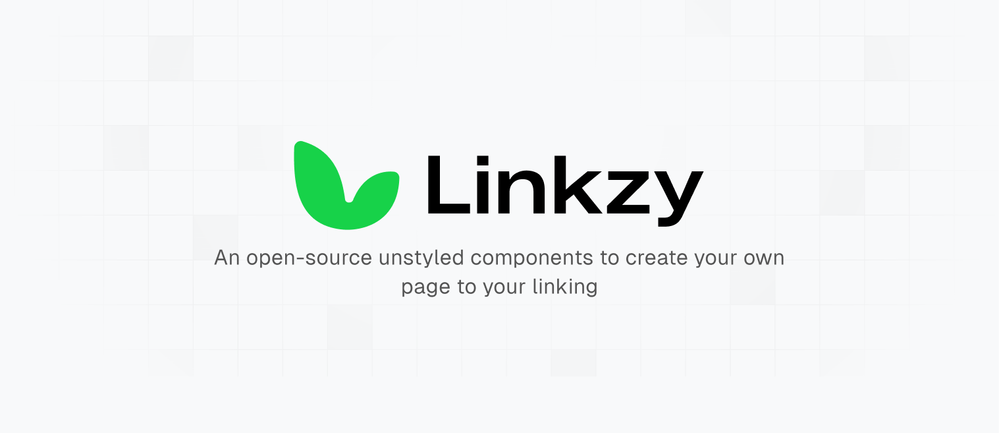

<div align="center"><strong>Linkzy</strong></div>
<div align="center">Unstyled components for creating pages similar to Linktree.</div>
<br />
<div align="center">
<a href="https://github.com/coderdiaz/linkzy">GitHub</a> 
<!-- <span> · </span>
<a href="#">Discord</a> -->
</div>

## Introduction

An open-source collection of unstyled components for creating pages similar to Linktree using React, Vue (soon) and Svelte (soon). Stop creating pages with the same styles as everyone else. With Linkzy you can create your own styles and customize your page to your liking.

## Install

Install one of the components from your command line.

#### With yarn

```sh
yarn add @linkzy/react -E
```

#### With npm

```sh
npm install @linkzy/react -E
```

#### With pnpm

```sh
pnpm install @linkzy/react -E
```

## Getting Started

Add the component to your template. Include styles where needed.

```jsx
import * as Linkzy from '@linkzy/react';

const Template = () => {
  return (
    <Linkzy.Root>
      <Linkzy.Head>
        <Linkzy.Avatar>
          
        </Linkzy.Avatar>
        <Linkzy.Content>
          <Linkzy.Title label="Javier Diaz" />
          <Linkzy.Bio>A software engineer who designs</Linkzy.Bio>
        </Linkzy.Content>
      </Linkzy.Head>
      <Linkzy.Group>
        <Linkzy.Link
          href="https://youtube.com/@coderdiaz"
          label="Visita mi canal de Youtube"
        />
        <Linkzy.Link
          href="https://twitch.tv/coderdiaz"
          label="Visita mi canal de Twitch"
        />
        <Linkzy.Link
          href="https://coderdiaz.dev/contacto"
          label="Ponte en contacto conmigo"
        />
      </Linkzy.Group>
    </Linkzy.Root>
  );
};
```

## Authors

- Javier Diaz ([@coderdiaz](https://x.com/coderdiaz))

## License

Licensed under the mIT License, Copyright &copy; 2023 Javier Diaz Chamorro

See [LICENSE](./LICENSE.md) for more information.
